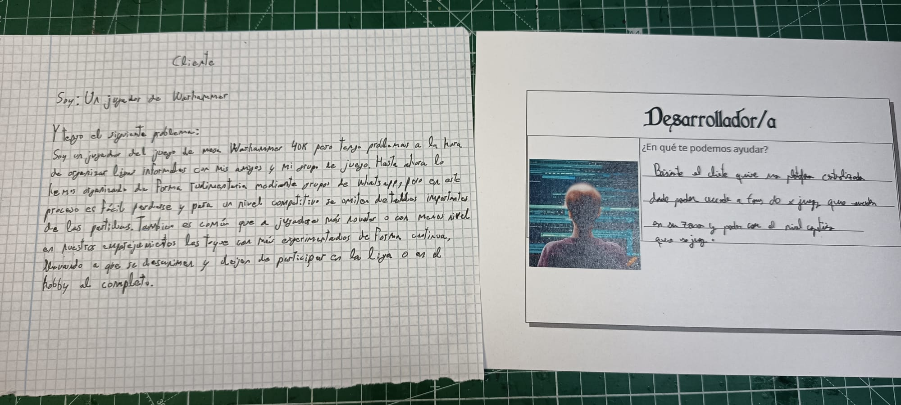

# MyTournamentPal

## Validación de juego de rol en clase

## ¿Cúal es el problema?

El cliente es un jugador del wargame de mesa Warhammer 40k. Recientemente, al intentar hacer una liga con la que jugar con su grupo de juego y amigos se han dado cuenta de que tienen medios precarios. La organización se realiza sola y exclusivamente por WhatsApp de forma desorganizada y sin seguir ningún criterio. Además, este grupo quiere alcanzar un nivel más competitivo, por lo que despues de cada partida el resto de miembros de la liga no saben como ha ido, en que rondas se ha puntuado que y otra información vital con la que conocer mejor a sus futuros rivales y pairings. 

## ¿Que datos hay disponibles?

La propia tarea de apuntar las partidas depende enteramente de los usuarios de los jugadores que participen en la liga. Sin embargo, la lógica de las mismas, el cómo se realiza la puntuación dentro de ellas y cualquier otro aspecto sigue un conjunto de reglas bien definidas en el juego de mesa. La puntuación se divide entre las llamadas misiones primarias y secundarias, siendo las primarias dependientes de con quien toque jugar y las segundas elegidas de forma aleatoria de unas opciones previamente definidas. 

Estas reglas se encuentran en el propio material del juego de mesa, aunque de forma online hay varias plataformas tales como Wahapedia, GDMissions o los propios medios y artículos facilitados por la empresa creadora del juego, Games Workshop. 

## Lógica de Negocio

Si bien parece que simplemente con apuntar a los jugadores y sus puntuaciones se resolvería el problema, esto no sería cierto. Quedandose en una solución tan simple no sería si no transportar el problema de tener toda esa información en una aplicación en la nube en vez de en un grupo de Whatsapp. 

El problema requiere varios pasos extra que aportan complejidad a su resolución:
    - El cliente necesita generar encuentros con otros jugadores a su nivel (o con los que menos se alejen) que participen en el evento. Este cálculo debería hacerse sobre los encuentros en la misma liga siguiendo sistemas de emparejamiento como el sistema suizo.
    - Estos encuentros a su vez, van a tener que ser válidados para garantizar que se esten respetando las reglas de puntuación del juego. 
    - Para que el resto de jugadores no vea simplemente los puntos que ha hecho cada uno (como está siendo hasta ahora), el cliente sigue necesitando algún tipo de resumen o filtrado de los datos de cada partida. 