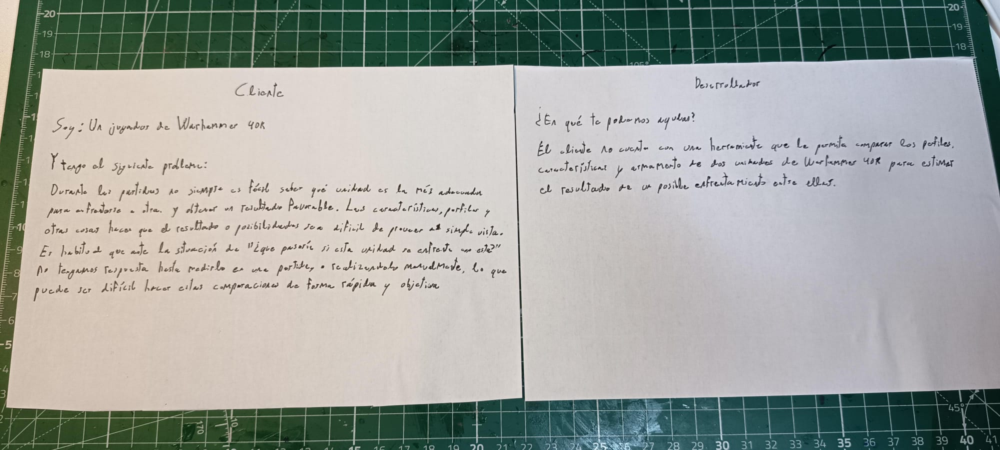

# MyTournamentPal

## Validación de juego de rol en clase

## ¿Cuál es el problema?

Soy un jugador de Warhammer 40k y una situación que muchos jugadores viven en cada partida, independientemente de cuanto tiempo lleven en este juego, es que muchas veces no saben cuando merece la pena enfrentar una unidad con otra en mesa o que resultados esperar.

Cada unidad de un ejército en el juego tiene unas características, unos perfiles de armas y coste en puntos. Estas estadísticas pueden verse modificadas por reglas extra, propias e cada unidad, o del propio ejército que tiene un jugador. Debido a estos factores y de la propia aleatoridad del juego al funcionar con dados, es complicado saber que resultado esperar de cada enfrentamiento. 

Por ejemplo, una unidad que cueste menos puntos que otra, por alguno de sus perfiles de armas, puede llegar a hacer daño y debilitar a otra de mayor coste. 

Actualmente para realizar estas comparativas y simular como puede suceder un combate, cualquier aficionado tiene que buscar las fichas de cada unidad y compararlas el mismo manualmente. El problema planteado por tanto, es desarrollar un sistema capaz de simular enfrentamientos entre unidades de Warhammer 40k y estimar su posible resultado.  

## ¿Que datos hay disponibles?

Los datos necesarios para realizar estas simulaciones se pueden encontrar de forma disponible en diversas fuentes y abiertos para su uso:
- Wahapedia.ru ofrece de forma abierta en formato .CSV las reglas de todas las unidades del juego. 
- De igual forma, el proyecto BSData cumple la misma función usando el formato .json. 

Cualquier producto a desarrollar tendría que usar alguna de las dos fuentes para alimentar su Base de Datos con la que realizar las simulaciones posteriormente

## Lógica de Negocio

El producto tendrá que calcular la simulación del resultado de un enfrentamiento entre dos perfiles de dos unidades distintas teniendo en cuenta las características de base de cada unidad y el armamento seleccionado. 

De forma simplificada, para realizar un ataque en Warhammer 40k se selecciona un perfil de la ficha de una unidad y se elige a que unidad del rival se atacará. En ese momento se realizan una serie de pasos:
- Se comprueba si el ataque logra impactar teniendo en cuenta la dificultad en el perfil (supongamos que indica +4, impactarán solo aquellos dados con valor superior o igual a 4).
- Se calcula el valor necesario para herir comparando la fuerza del perfil con la resistencia de la unidad objetivo. Si la fuerza es igual que la resistencia al +4; si es menor al +5, al +6 si lo es el doble; si es mayor al +3, al +2 si es el doble.
- Se procede a la tirada y todos los que pasen, el rival deberá "salvarlos". Esto es tirar un dado igual al valor de la característica de Salvación de la humanidad. Este valor es afectado por la penetración del arma que dispare: supongamos que un perfil tiene -1 de Penetración y la unidad a la que disparan tiene +4 de Salvación. Se aplica la penalización y ahora salva al +5. 
- Una vez resueltas las salvaciones, aquellos dados para herir que no hayan sido retirados harán daño. Este daño estará en el perfil del arma y restará heridas al perfil atacado. 

Debido a que las tiradas son aleatorias, usar un cálculo probabilistico puede ser una opción recomendable. 

## Referencias 

- [Documentacion complementaria](documentacion_extra.md): documentación complementaria en la que se muestra la configuración previa de git. 