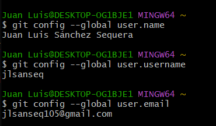
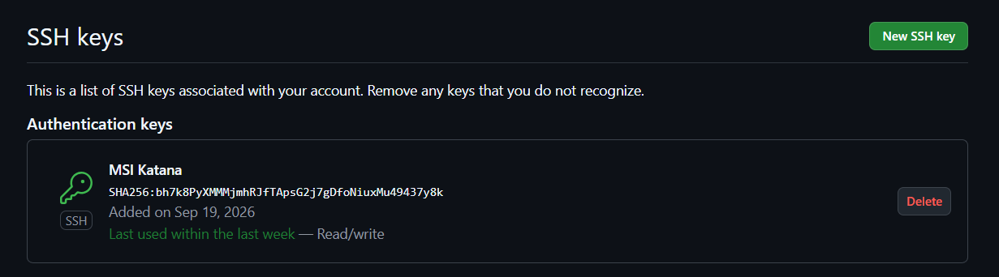

# Documentación Extra

En este archivo se muestran las configuraciones previas de git para el correcto desarrollo de la asignatura, tales como definir el usuario, correo y claves ssh público/privadas a usar:

- Configuración tanto del nombre como del correo: 
- Clave pública subida a GitHub: 
